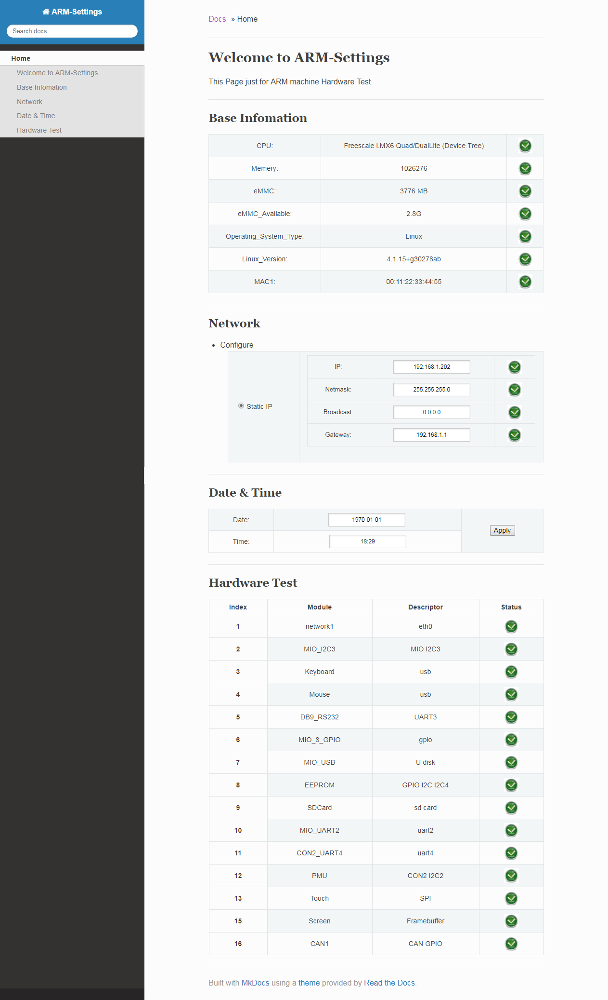

# MiniOS Web Page

该自动化测试框架，只需要配置[configs/system_config.json](configs/system_config.json)文件，无需修改任何其他的内容。



## php file include 

* index.php
  * functions.php
  * header.php
  * body.php
    * system_info.php
    * network.php
    * data_and_time.php
    * hardware_test.php

## data protocol

* [docs/json_protocol](docs/json_protocol.md)

## Config Parser

[functions.php](functions.php)
```

## System Config Analysis

```
{
    /**
     * 导航栏配置代码: cat navigation.php
     * ...
     * foreach ($MiniOS->configs["navigation"] as $key => $value) {
     *     if ($key == "welcome") {
     *         echo "<li class='toctree-l3'><a href='".$value["link"]."'>".$value["content"]."</a></li>\n";
     *     } else {
     *         echo "<li><a class='toctree-l4' href='".$value["link"]."'>".$value["content"]."</a></li>\n";
     *     }
     * }
     * ...
     */
    "navigation" : {
        "welcome" : {
            "link" : "#welcome-to-arm-settings", 
            "content" : "Welcome to ARM-Settings"
        },
        "system_info" : {
            "link" : "#base-infomation", 
            "content" : "Base Infomation"
        },
        [...](省略)
    },
    /**
     * foreach ($MiniOS->configs["system_info"] as $key => $value) {
     *     echo "<tr>";
     *     echo "  <td>".$key.":</td>\n";
     *     $ret = exec($value["cmd"][$MiniOS->system_type]);
     *     echo "  <td>".$ret."</td>\n";
     *     echo "  <td>";
     *     if ($ret != null)
     * 	        echo "   ";
     *     else
     * 	        echo "   ";
     *     echo "  </td>";
     *     echo "</tr>";
     * }
     */
    "system_info" : {
        "CPU" : {
            "cmd" : {
                "armv7l" : "grep Hardware /proc/cpuinfo | awk -F ':' '{print $2}' | sed 's/ Sabre-SD Board//g'",
                "x86_64" : "cat /proc/cpuinfo | grep 'model name' | tail -n 1 | awk -F ':' '{print $2}' | xargs"
            },
            "compare" : {
                "armv7l" : "",
                "x86_64" : ""
            }

        },
        "Memery" : {
            "cmd" : {
                "armv7l" : "grep MemTotal /proc/meminfo | awk -F ':' '{print $2}' | awk -F ' ' '{print $1}'",
                "x86_64" : "grep MemTotal /proc/meminfo | awk -F ':' '{print $2}' | awk -F ' ' '{print $1}'"
            },
            "compare" : {
                "armv7l" : "",
                "x86_64" : ""
            }
        },
        [...](省略)
    },
    [...](省略)
    /**
     * 1. html:
     *     foreach ($MiniOS->configs["hardware_test"] as $key => $value) {
     *         echo "<tr>";
     *         echo "<th scope='row'>".$value["index"]."</th>";
     *         echo "<td>".$key."</td>";
     *         echo "<td>".$value["descriptor"]."</td>";
     *         echo "<td>";
     *         echo "";
     *         echo "</td>";
     *         echo "</tr>";
     *     }
     * 2. javascript:
     *     var test_items = Object.keys(MiniConfig);
     *     for (i = 0; i < test_items.length; i++) {
     *         item = test_items[i];
     *         console.log(item);
     *         // gpio
     *         if (data["data"].hasOwnProperty(item)) {
     *             if (data["data"][item]["status"] == "ok") {
     *                 $("#" + item + "_status").attr("src", "img/ok.png")
     *             }
     *         }
     *     }
     * 3. ajax:
     *     $test_items = $MiniOS->configs["hardware_test"];
     *     $test_items_sections = $MiniOS->get_config_sections($test_items);
     *     foreach ($test_items_sections as $item) {
     *         if (isset($test_items[$item]["shell"])) {
     *             $result = exec($test_items[$item]["shell"]);
     *             $json_array["data"][$item]["result"] = $result;
     *             if ((isset($test_items[$item]["ret"]) && ($result == $test_items[$item]["ret"])) ||
     *                     (! isset( $test_items[$item]["ret"]) && ($result != null))) {
     *                 $json_array["data"][$item]["status"] = "ok";
     *             } else {
     *                 $json_array["data"][$item]["status"] = "error";
     *             }
     *         }
     *     }
     */
    "hardware_test" : {
        "network1" : {
            "index" : 1,
            "shell" : "ping -c 1 -W 1 192.168.1.20 2>&1 | grep ', 0% packet loss'",
            "descriptor" : "eth0",
            "range" : "192.168.1.20",
            "value" : "192.168.1.20",
            "status" : "error"
        },
        "rtc" : {
            "index" : 2,
            "shell" : "hwclock -r > /dev/null && echo $?",
            "descriptor" : "i2c",
            "range" : "",
            "value" : "",
            "status" : "error"
        },
        [...](省略)
    }
}
```
